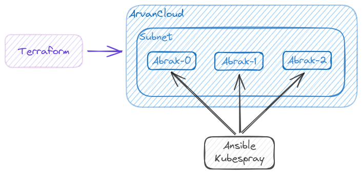

# IP Geolocation Detection API

    

This repository contains API that detects IP geolocation, as well as Terraform code for deploying the API on ArvanCloud, Ansible KubeSpray for Kubernetes cluster deployment, Kubernetes Deployment manifests, and monitoring using Prometheus and Grafana.

## Getting Started
To get started with this project, follow these steps:
1. Clone the repository to your local machine.
2. Install the required dependencies by running `pip install -r requirements.txt`.
3. Deploy the API on ArvanCloud using Terraform by running `terraform apply`.
4. Deploy the Kubernetes cluster using Ansible KubeSpray by running `ansible-playbook -i inventory/arvancluster/hosts.yaml  --become --become-user=root cluster.yml`.
5. Deploy the Kubernetes Deployment manifests by running `kubectl apply -f deployment.yaml`.

## API Documentation
The API documentation can be found in the `app/README.md` file.

## Contributing
If you would like to contribute to this project, please follow these steps:
1. Fork the repository.
2. Create a new branch for your changes.
3. Make your changes and commit them.
4. Push your changes to your fork.
5. Submit a pull request.

## Acknowledgments
- The IP geolocation detection code is based on the `ip-api.com` API.
- The Kubernetes Deployment manifests are based on the Kubernetes Guestbook Example.
